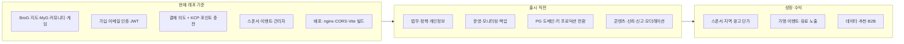

# BroGourmet — 최종 서비스까지 로드맵 & 출시 체크리스트

> 문서 목적: 현재 구현 상태에서 **출시·성장**까지 필요한 검토 항목을 한곳에 모은다.  
> 관련 산출물: 동일 내용의 슬라이드 `service-launch-roadmap.pptx` (도표·체크리스트 포함)

**기준일:** 2026-04-19 (KST)

---

## 1. 로드맵 개요 (개념도)



---

## 2. 우선순위 높은 수정·보완 (체크리스트)

| # | 항목 | 세부 내용 | 완료 |
|---|------|-----------|:----:|
| 2.1 | 출시 빌드·환경 | `VITE_API_BASE_URL`, 카카오·KCP 등 **프로덕션 전용** 분리; www에서 LAN IP로 API 고정 금지 (`run.txt` 체크리스트화) | ☐ |
| 2.2 | 단계적 오픈 | `VITE_BROG_ONLY` 등 **단계별로 어떤 메뉴를 켤지** 운영·마케팅과 합의 후 문서화 | ☐ |
| 2.3 | 법·정책 | 이용약관, 개인정보처리방침, 위치정보, 결제/환불 — UI 노출 및 **동의·이력** 필요 시 설계 | ☐ |
| 2.4 | 개발용 노출 제거 | 가입/이메일 인증 화면의 **개발용 토큰 안내** — 프로덕션에서는 숨김 또는 `DEV` 전용 | ☐ |
| 2.5 | 보안·세션 | JWT `localStorage` 사용 시 **CSP·입력 검증·의존성 업데이트**; (선택) httpOnly 쿠키는 출시 후 과제로 분리 가능 | ☐ |
| 2.6 | 결제·정산 | KCP 실결제 전: 콜백 URL, 실패/타임아웃, 영수증·취소, CS 프로세스 | ☐ |
| 2.7 | 운영 | DB **자동 백업·복구 연습** 주기; API 헬스체크·로그 수집 최소 도입 | ☐ |
| 2.8 | 콘텐츠·신뢰 | 자유게시·BroG·MyG·스폰 — **신고·차단·운영자 검토** 최소 설계 | ☐ |

---

## 3. 추가하면 좋은 기능 (아이디어 체크리스트)

| # | 아이디어 | 메모 | 완료 |
|---|----------|------|:----:|
| 3.1 | 온보딩 | BroG / MyG / 지도 차이를 짧게 안내하는 첫 방문 화면 | ☐ |
| 3.2 | 알림 | 이메일 외 웹 푸시 또는 알림톡(비용·정책 검토) | ☐ |
| 3.3 | 검색·발견 | 즐겨찾기, 최근 본 매장 | ☐ |
| 3.4 | 가맹/사장님 | 노출 통계(조회 수) 등 B2B 대화용 최소 지표 | ☐ |

---

## 4. 비즈니스 모델 후보 (레포와의 연결)

| 축 | 설명 | 제품 연결 |
|----|------|-----------|
| 스폰서·네이티브 광고 | 구·카테고리·지도 상단 스폰서 슬롯 | 스폰서 스페이스·캐러셀 — 노출·클릭 측정 시 상품화 |
| 가맹점 결제·이벤트 | 이벤트 등록비·참가비 | `PaymentPage` 가맹 탭, `intent_kind: merchant` |
| 일반 회원 포인트 | 충전 후 앱 내 사용 | `point_charge` — **포인트 소비처** 정의가 다음 과제 |
| 구독(프리미엄) | 광고 제거·추천 우선 등 | `/payment?tab=user` 방향 — 혜택·과금 정의 필요 |
| 데이터·리드 | 예약·단체 문의 리드를 매장에 전달, 수수료 | BroG 상세·외부 링크 |
| B2B 리포트 | 구별 인기 카테고리·시간대(익명 집계) | 프라이버시 가이드와 병행 |

---

## 5. 새 방향 아이디어 (선택)

- **이 동네 오늘의 메뉴**: 짧은 큐레이션 → 스폰서 슬롯과 묶기  
- **점메추(SADARI) × 스폰서**: 결과 근처 비침습 스폰 한 줄  
- **지역 미디어 제휴**: 스폰서 패키지 공동 판매  

---

## 6. 한 줄 요약

**기술적으로는** 지도·UGC·결제·스폰서·관리까지 MVP 이상에 가깝고, **최종 서비스까지 남은 일**은 주로 **법무·운영·결제 실서비스·신뢰(신고/모더레이션)·수익 설계를 제품에 녹이는 일**이다.

---

## 7. PPT 재생성 방법

저장소 루트(`brogourmet`)에서 한 번만 의존성 설치 후 스크립트 실행:

```powershell
cd d:\project\brogourmet
py -m pip install python-pptx
py scripts\generate_service_launch_ppt.py
```

(`pip`/`python`이 PATH에 있으면 동일하게 `pip install …`, `python scripts\…` 사용 가능.)

생성 파일: `docs\service-launch-roadmap.pptx`
